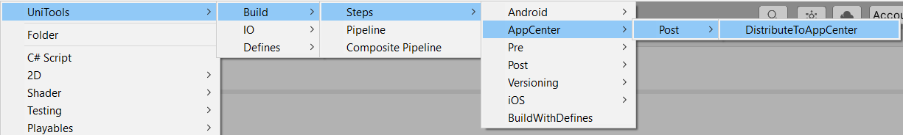
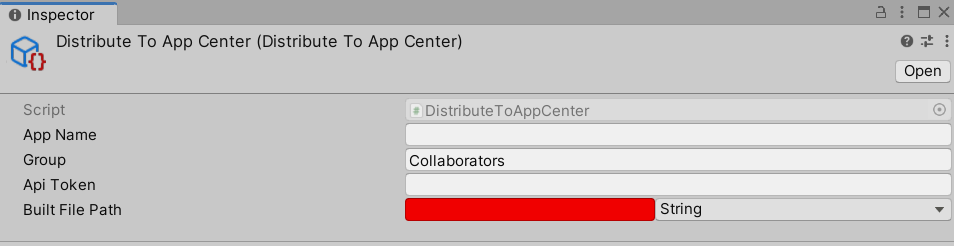

  # UniTools Build AppCenter
Build steps to distribute the artifact to the AppCenter

# Features
- Deploy mobile builds (.ipa and .apk) to the App Center application using [AppCenter CLI](https://docs.microsoft.com/en-us/appcenter/cli/)

# Dependencies
- [UniTools CLI](https://github.com/UniToolsTeam/unitools-cli)
- [UniTools IO](https://github.com/UniToolsTeam/unitools-io)
- [UniTools Build](https://github.com/UniToolsTeam/unitools-build)

# Installation
Install [AppCenter CLI](https://docs.microsoft.com/en-us/appcenter/cli/)

### Download
[Latest Releases](../../releases/latest)

### Unity Package Manager (UPM)

> You will need to have git installed and set in your system PATH.
> Check package [dependencies](https://github.com/UniToolsTeam/unitools-build-ios/blob/master/package.json)

Add the following to `Packages/manifest.json` where x.x.x the version (tag) check [Latest Releases](../../releases/latest):

```
{
  "dependencies": {
    "com.unitools.cli": "https://github.com/UniToolsTeam/unitools-cli.git#x.x.x",
    "com.unitools.io": "https://github.com/UniToolsTeam/unitools-io.git#x.x.x",
    "com.unitools.build": "https://github.com/UniToolsTeam/unitools-build.git#x.x.x",
    "com.unitools.build.appcenter": "https://github.com/UniToolsTeam/unitools-build-appcenter.git#x.x.x",
    "...": "..."
  }
}
```

# Getting Started

To deploy the build to the App Center, follow the instructions: 

1. Create a post-build step through UniTools/Build/Steps/AppCenter/Post/DistributeToAppCenter in the Create Asset menu.


2. Fill in the data in the Inspector window:


Where,
- App Name - application name ```{owner-name}/{app-name}```, that you can find from an App Center URL, it's in the format ```https://appcenter.ms/users/{owner-name}/apps/{app-name}```. For more details and instructions on how to get the app name using App Center CLI go to this link https://docs.microsoft.com/en-us/appcenter/api-docs/#find-your-app-center-app-name-and-owner-name
- Group - destination group, the default value is "Collaborators"
- If AppCenter is not setuped then need firstly install or update [Node.js](https://nodejs.org/uk/) and then in Command Prompt enter `npm install -g appcenter-cli` and wait while downloading complete.
- Api Token - app API token https://docs.microsoft.com/en-us/appcenter/api-docs/#creating-an-app-center-app-api-token
